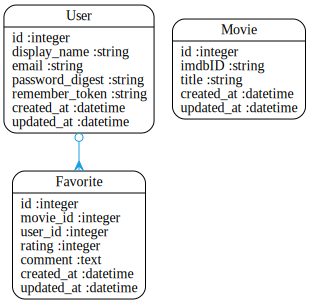

Code Review for jason_k
================================================
Project: Trailer_App
================================================
#URLS

* HEROKU: https://trailerapp.herokuapp.com/
* GITHUB: https://github.com/jasonckim/Trailer_App


# Summary

A nicely conceived and presented project. There's not too much code but it nicely combines two APIs. The authorization code looks weak, as though it would be easy to bypass.

Remember that you don't need to use "" for strings unless you are doing string interpolation, check your formatting and remember to add some comments to you code!

There's a lack of javascript, but the visuals are great

Nice work Jason


#Review Rubric

##Implemtation Expecations

* Models & Data Relationships
	* Expectation: At least 2 related models
	* Review: ++ Yes!
* Handles Invalid Data
	*  Expectation: Rails model validation for presence of necessary fields
	* Review: ++ Each model has some validations
* Views & Templates	
	*  Expectation: Form partial used, but other duplication still exists
	* Review: 0 No Partials used, but no real need
* Authentication
	*  Expectation: Appropriate helper methods defined
	* Review: -- Not really, a few actions are protected but not all
* Authorization
	* Expectation: Authorization scheme is well-thought out and used correctly.
	* Review: -- I don't see this at all
* API
	*  Expectation: An API call was made.
	* Review: ++ Yes used Typheous to call IMDB and OMDBAPI
* Testing
	*  Expectation: Includes request specs.
	* Review:0 - 8 Tests but no request specs
* Heroku
	*  Expectation: Project is hosted on Heroku
	* Review:Yes https://trailerapp.herokuapp.com/
* JavaScript/jQuery
	* Expectation: JS/jQuery is used to handle at least one interactive event after the window loads
	* Review:-- No Javascript used

##Code Quality Expectations

* Test Driven
	* Expectation: In addition to models, requests have been tested for valid 	responses and valid data
	* Review:-- No request specs
* Flexible / extensible / scalable
	* Expectation: No database calls inside a loop
	* Review:Might want to cache some API calls
* Well-commented
	* Expectation: Comments are not sporadic. Comments address the "why".
	* Review:-- No comments really
* Well-formatted, Clean Project
	* Expectation: No mix of tabs and spaces
	* Review:Not too bad, but could be more picky about indentation
* Follows naming conventions
	* Expectation: Naming follows best practices (semantic variable naming)
	* Review:Yes
* Secure
	* Expectation: Authorization is implemented as well as authentication.  Athorization is achieved through controller methods or helpers that limit resources
	* Review:Implementedn authentication but not used often in the app
* Documenting Work
	* Expectation: Public presentation of work involving key aspects of development process
	* Review:--The default README.rdoc is still present, this should be changed to represent your project


#Your Gemfile

```
ruby '2.1.1'

source 'https://rubygems.org'

# Bundle edge Rails instead: gem 'rails', github: 'rails/rails'
gem 'rails', '4.0.4'

# Use SCSS for stylesheets
gem 'sass-rails', '~> 4.0.2'

# Use Uglifier as compressor for JavaScript assets
gem 'uglifier', '>= 1.3.0'

# Use CoffeeScript for .js.coffee assets and views
gem 'coffee-rails', '~> 4.0.0'

# See https://github.com/sstephenson/execjs#readme for more supported runtimes
# gem 'therubyracer', platforms: :ruby

# Use jquery as the JavaScript library
gem 'jquery-rails'

# Turbolinks makes following links in your web application faster. Read more: https://github.com/rails/turbolinks
gem 'turbolinks'

# Build JSON APIs with ease. Read more: https://github.com/rails/jbuilder
gem 'jbuilder', '~> 1.2'

gem 'typhoeus'

gem 'json'

gem 'capybara'

gem 'nokogiri'

gem 'bootstrap_form'

group :development, :test do
  gem 'dotenv-rails'
  gem 'pry'
  gem 'rspec-rails'
  gem 'factory_girl_rails'
end

group :production do
  gem 'rails_12factor'
  gem 'pg'
end

group :doc do
  # bundle exec rake doc:rails generates the API under doc/api.
  gem 'sdoc', require: false
end

# Use ActiveModel has_secure_password
gem 'bcrypt', '~> 3.1.7'

# Use unicorn as the app server
# gem 'unicorn'

# Use Capistrano for deployment
# gem 'capistrano', group: :development

# Use debugger
# gem 'debugger', group: [:development, :test]

```


#Your Schema

```
# encoding: UTF-8
# This file is auto-generated from the current state of the database. Instead
# of editing this file, please use the migrations feature of Active Record to
# incrementally modify your database, and then regenerate this schema definition.
#
# Note that this schema.rb definition is the authoritative source for your
# database schema. If you need to create the application database on another
# system, you should be using db:schema:load, not running all the migrations
# from scratch. The latter is a flawed and unsustainable approach (the more migrations
# you'll amass, the slower it'll run and the greater likelihood for issues).
#
# It's strongly recommended that you check this file into your version control system.

ActiveRecord::Schema.define(version: 20140508000205) do

  # These are extensions that must be enabled in order to support this database
  enable_extension "plpgsql"

  create_table "favorites", force: true do |t|
    t.integer  "movie_id"
    t.integer  "user_id"
    t.integer  "rating"
    t.text     "comment"
    t.datetime "created_at"
    t.datetime "updated_at"
  end

  add_index "favorites", ["movie_id"], name: "index_favorites_on_movie_id", using: :btree
  add_index "favorites", ["user_id"], name: "index_favorites_on_user_id", using: :btree

  create_table "movies", force: true do |t|
    t.string   "imdbID"
    t.string   "title"
    t.datetime "created_at"
    t.datetime "updated_at"
  end

  create_table "users", force: true do |t|
    t.string   "display_name"
    t.string   "email"
    t.string   "password_digest"
    t.string   "remember_token"
    t.datetime "created_at"
    t.datetime "updated_at"
  end

end

```


#Your Schema Diagram





#Your Rspec Results

```

SessionsController
  GET 'new'
    returns http success

Movie
  title
    should not be empty
  imdbID
    should not be empty

Favorite
  movie_id
    should not be empty
  user_id
    should not be empty

User
  email
    should have a valid format
    should not be empty
    should be unique

Finished in 0.08837 seconds
8 examples, 0 failures

Randomized with seed 39173


```


#Automated Best Practices Review Results

```


Source Codes: |=========================================================================================|
/work/ga/wdi/2014/march/project1/jason_k/app/helpers/favorites_helper.rb:1 - remove empty helpers
/work/ga/wdi/2014/march/project1/jason_k/app/helpers/movies_helper.rb:1 - remove empty helpers
/work/ga/wdi/2014/march/project1/jason_k/app/helpers/users_helper.rb:1 - remove empty helpers
/work/ga/wdi/2014/march/project1/jason_k/app/helpers/sessions_helper.rb:3 - remove unused methods (SessionsHelper#sign_in)
/work/ga/wdi/2014/march/project1/jason_k/app/helpers/sessions_helper.rb:12 - remove unused methods (SessionsHelper#signed_in_user)
/work/ga/wdi/2014/march/project1/jason_k/app/helpers/sessions_helper.rb:19 - remove unused methods (SessionsHelper#sign_out)
/work/ga/wdi/2014/march/project1/jason_k/app/helpers/sessions_helper.rb:24 - remove unused methods (SessionsHelper#current_user=)
/work/ga/wdi/2014/march/project1/jason_k/config/routes.rb:3 - restrict auto-generated routes users (only: [:new, :create, :update])
/work/ga/wdi/2014/march/project1/jason_k/config/routes.rb:5 - restrict auto-generated routes sessions (only: [:new, :create, :destroy])
/work/ga/wdi/2014/march/project1/jason_k/app/controllers/favorites_controller.rb:7 - use model association (for @fav)
/work/ga/wdi/2014/march/project1/jason_k/app/models/user.rb:5 - remove trailing whitespace
/work/ga/wdi/2014/march/project1/jason_k/app/helpers/sessions_helper.rb:5 - remove trailing whitespace
/work/ga/wdi/2014/march/project1/jason_k/app/controllers/favorites_controller.rb:2 - remove trailing whitespace
/work/ga/wdi/2014/march/project1/jason_k/app/controllers/movies_controller.rb:23 - remove trailing whitespace
/work/ga/wdi/2014/march/project1/jason_k/app/controllers/users_controller.rb:11 - remove trailing whitespace
/work/ga/wdi/2014/march/project1/jason_k/config/routes.rb:19 - remove trailing whitespace
/work/ga/wdi/2014/march/project1/jason_k/app/views/movies/results.html.erb:2 - remove trailing whitespace

Please go to http://rails-bestpractices.com to see more useful Rails Best Practices.

Found 17 warnings.

```


#Automated Code Review Results

```
Inspecting 30 files
CCCCWCCCWCCCC...C..C.CCCCCCWCC

Offenses:

app/controllers/application_controller.rb:1:1: C: Missing top-level class documentation comment.
class ApplicationController < ActionController::Base
^^^^^
app/controllers/favorites_controller.rb:1:1: C: Missing top-level class documentation comment.
class FavoritesController < ApplicationController
^^^^^
app/controllers/favorites_controller.rb:2:1: C: Trailing whitespace detected.
app/controllers/favorites_controller.rb:23:1: C: 1 trailing blank lines detected.
app/controllers/movies_controller.rb:1:1: C: Missing top-level class documentation comment.
class MoviesController < ApplicationController
^^^^^
app/controllers/movies_controller.rb:2:1: C: Use 2 (not 0) spaces for indentation.
before_filter :signed_in_user, only: [:show, :results]

app/controllers/movies_controller.rb:4:1: C: Missing space after #.
#What about protecting all the other actions?
^^^^^^^^^^^^^^^^^^^^^^^^^^^^^^^^^^^^^^^^^^^^^
app/controllers/movies_controller.rb:12:27: C: Prefer single-quoted strings when you don't need string interpolation or special symbols.
  response = Typhoeus.get("http://www.omdbapi.com/", :params => {:s => search_str})
                          ^^^^^^^^^^^^^^^^^^^^^^^^^
app/controllers/movies_controller.rb:12:54: C: Use the new Ruby 1.9 hash syntax.
  response = Typhoeus.get("http://www.omdbapi.com/", :params => {:s => search_str})
                                                     ^^^^^^^^^^
app/controllers/movies_controller.rb:12:65: C: Space inside { missing.
  response = Typhoeus.get("http://www.omdbapi.com/", :params => {:s => search_str})
                                                                ^
app/controllers/movies_controller.rb:12:66: C: Use the new Ruby 1.9 hash syntax.
  response = Typhoeus.get("http://www.omdbapi.com/", :params => {:s => search_str})
                                                                 ^^^^^
app/controllers/movies_controller.rb:12:80: C: Line is too long. [83/79]
  response = Typhoeus.get("http://www.omdbapi.com/", :params => {:s => search_str})
                                                                               ^^^^
app/controllers/movies_controller.rb:12:82: C: Space inside } missing.
  response = Typhoeus.get("http://www.omdbapi.com/", :params => {:s => search_str})
                                                                                 ^
app/controllers/movies_controller.rb:14:22: C: Prefer single-quoted strings when you don't need string interpolation or special symbols.
  @movies = omdbdata["Search"]
                     ^^^^^^^^
app/controllers/movies_controller.rb:17:1: C: Method has too many lines. [13/10]
def results
^^^
app/controllers/movies_controller.rb:19:23: C: Prefer single-quoted strings when you don't need string interpolation or special symbols.
  info = Typhoeus.get("http://www.omdbapi.com/", :params => {:i => imdb_id})
                      ^^^^^^^^^^^^^^^^^^^^^^^^^
app/controllers/movies_controller.rb:19:50: C: Use the new Ruby 1.9 hash syntax.
  info = Typhoeus.get("http://www.omdbapi.com/", :params => {:i => imdb_id})
                                                 ^^^^^^^^^^
app/controllers/movies_controller.rb:19:61: C: Space inside { missing.
  info = Typhoeus.get("http://www.omdbapi.com/", :params => {:i => imdb_id})
                                                            ^
app/controllers/movies_controller.rb:19:62: C: Use the new Ruby 1.9 hash syntax.
  info = Typhoeus.get("http://www.omdbapi.com/", :params => {:i => imdb_id})
                                                             ^^^^^
app/controllers/movies_controller.rb:19:75: C: Space inside } missing.
  info = Typhoeus.get("http://www.omdbapi.com/", :params => {:i => imdb_id})
                                                                          ^
app/controllers/movies_controller.rb:21:21: C: Prefer single-quoted strings when you don't need string interpolation or special symbols.
  @link = @infodata["imdbID"]
                    ^^^^^^^^
app/controllers/movies_controller.rb:22:22: C: Prefer single-quoted strings when you don't need string interpolation or special symbols.
  @title = @infodata["Title"]
                     ^^^^^^^
app/controllers/movies_controller.rb:25:1: C: Trailing whitespace detected.
app/controllers/movies_controller.rb:26:80: C: Line is too long. [100/79]
  response = Typhoeus.get("https://api.themoviedb.org/3/movie/#{@link}?api_key=#{ENV['MOVIE_KEY']}")
                                                                               ^^^^^^^^^^^^^^^^^^^^^
app/controllers/movies_controller.rb:28:23: C: Prefer single-quoted strings when you don't need string interpolation or special symbols.
  @called = trailerid["id"]
                      ^^^^
app/controllers/movies_controller.rb:29:80: C: Line is too long. [104/79]
  var = Typhoeus.get("https://api.themoviedb.org/3/movie/#{@called}/videos?api_key=#{ENV['MOVIE_KEY']}")
                                                                               ^^^^^^^^^^^^^^^^^^^^^^^^^
app/controllers/movies_controller.rb:31:16: C: Prefer single-quoted strings when you don't need string interpolation or special symbols.
  @var3 = var2["results"][0]["key"]
               ^^^^^^^^^
app/controllers/movies_controller.rb:31:30: C: Prefer single-quoted strings when you don't need string interpolation or special symbols.
  @var3 = var2["results"][0]["key"]
                             ^^^^^
app/controllers/movies_controller.rb:34:1: C: Extra empty line detected at body end.
app/controllers/movies_controller.rb:46:1: C: Indent access modifiers like private.
private
^^^^^^^
app/controllers/movies_controller.rb:46:1: C: Keep a blank line before and after private.
private
^^^^^^^
app/controllers/movies_controller.rb:47:3: C: Inconsistent indentation detected.
  def favorite_params
  ^^^^^^^^^^^^^^^^^^^
app/controllers/movies_controller.rb:50:1: C: Extra empty line detected at body end.
app/controllers/sessions_controller.rb:1:1: C: Missing top-level class documentation comment.
class SessionsController < ApplicationController
^^^^^
app/controllers/sessions_controller.rb:9:38: C: Prefer single-quoted strings when you don't need string interpolation or special symbols.
      redirect_to home_path, notice: "Logged in!"
                                     ^^^^^^^^^^^^
app/controllers/sessions_controller.rb:11:23: C: Prefer single-quoted strings when you don't need string interpolation or special symbols.
      flash[:error] = "Name or password is invalid"
                      ^^^^^^^^^^^^^^^^^^^^^^^^^^^^^
app/controllers/sessions_controller.rb:12:14: C: Prefer single-quoted strings when you don't need string interpolation or special symbols.
      render "new"
             ^^^^^
app/controllers/sessions_controller.rb:18:35: C: Prefer single-quoted strings when you don't need string interpolation or special symbols.
    redirect_to root_url, notice: "Logged out"
                                  ^^^^^^^^^^^^
app/controllers/users_controller.rb:1:1: C: Missing top-level class documentation comment.
class UsersController < ApplicationController
^^^^^
app/controllers/users_controller.rb:2:1: C: Extra empty line detected at body beginning.
app/controllers/users_controller.rb:3:1: C: Use 2 (not 0) spaces for indentation.
def new

app/controllers/users_controller.rb:9:5: C: Inconsistent indentation detected.
    if @user.save
    ^^^^^^^^^^^^^
app/controllers/users_controller.rb:10:25: C: Prefer single-quoted strings when you don't need string interpolation or special symbols.
      flash[:success] = "Thanks for signing up!"
                        ^^^^^^^^^^^^^^^^^^^^^^^^
app/controllers/users_controller.rb:11:20: C: Trailing whitespace detected.
      sign_in @user 
                   ^
app/controllers/users_controller.rb:14:23: C: Prefer single-quoted strings when you don't need string interpolation or special symbols.
      flash[:error] = "Failed to create account.  Try again."
                      ^^^^^^^^^^^^^^^^^^^^^^^^^^^^^^^^^^^^^^^
app/controllers/users_controller.rb:15:14: C: Prefer single-quoted strings when you don't need string interpolation or special symbols.
      render "new"
             ^^^^^
app/controllers/users_controller.rb:17:3: W: end at 17, 2 is not aligned with def at 7, 0
  end
  ^^^
app/controllers/users_controller.rb:25:1: C: Indent access modifiers like private.
private
^^^^^^^
app/controllers/users_controller.rb:25:1: C: Keep a blank line before and after private.
private
^^^^^^^
app/controllers/users_controller.rb:26:3: C: Inconsistent indentation detected.
  def user_params
  ^^^^^^^^^^^^^^^
app/controllers/users_controller.rb:27:80: C: Line is too long. [90/79]
    params.require(:user).permit(:display_name, :email, :password, :password_confirmation)
                                                                               ^^^^^^^^^^^
app/controllers/users_controller.rb:30:1: C: 1 trailing blank lines detected.
app/helpers/application_helper.rb:1:1: C: Missing top-level module documentation comment.
module ApplicationHelper
^^^^^^
app/helpers/favorites_helper.rb:1:1: C: Missing top-level module documentation comment.
module FavoritesHelper
^^^^^^
app/helpers/movies_helper.rb:1:1: C: Missing top-level module documentation comment.
module MoviesHelper
^^^^^^
app/helpers/movies_helper.rb:2:1: C: Extra empty line detected at body beginning.
app/helpers/movies_helper.rb:3:4: C: Final newline missing.
end
   
app/helpers/sessions_helper.rb:1:1: C: Missing top-level module documentation comment.
module SessionsHelper
^^^^^^
app/helpers/sessions_helper.rb:2:1: C: Extra empty line detected at body beginning.
app/helpers/sessions_helper.rb:5:5: W: Useless assignment to variable - current_user.
    current_user = user 
    ^^^^^^^^^^^^
app/helpers/sessions_helper.rb:5:24: C: Trailing whitespace detected.
    current_user = user 
                       ^
app/helpers/sessions_helper.rb:15:38: C: Prefer single-quoted strings when you don't need string interpolation or special symbols.
      redirect_to login_url, notice: "Please sign in"
                                     ^^^^^^^^^^^^^^^^
app/helpers/sessions_helper.rb:21:36: C: Trailing whitespace detected.
    cookies.delete(:remember_token) 
                                   ^
app/helpers/sessions_helper.rb:24:3: C: Use attr_writer to define trivial writer methods.
  def current_user=(user)
  ^^^
app/helpers/users_helper.rb:1:1: C: Missing top-level module documentation comment.
module UsersHelper
^^^^^^
app/models/favorite.rb:1:1: C: Missing top-level class documentation comment.
class Favorite < ActiveRecord::Base
^^^^^
app/models/favorite.rb:5:36: C: Space inside { missing.
  validates :movie_id, uniqueness: {scope: :user_id}, presence: true
                                   ^
app/models/favorite.rb:5:52: C: Space inside } missing.
  validates :movie_id, uniqueness: {scope: :user_id}, presence: true
                                                   ^
app/models/movie.rb:1:1: C: Missing top-level class documentation comment.
class Movie < ActiveRecord::Base
^^^^^
app/models/user.rb:1:1: C: Missing top-level class documentation comment.
class User < ActiveRecord::Base
^^^^^
app/models/user.rb:2:1: C: Extra empty line detected at body beginning.
app/models/user.rb:5:1: C: Trailing whitespace detected.
app/models/user.rb:8:1: C: Trailing whitespace detected.
app/models/user.rb:9:52: C: Space inside { missing.
  validates :display_name, presence: true, length: {maximum: 50}
                                                   ^
app/models/user.rb:9:64: C: Space inside } missing.
  validates :display_name, presence: true, length: {maximum: 50}
                                                               ^
app/models/user.rb:12:19: C: Align the elements of a hash literal if they span more than one line.
                  format:     { with: VALID_EMAIL_REGEX },
                  ^^^^^^^^^^^^^^^^^^^^^^^^^^^^^^^^^^^^^^^
app/models/user.rb:13:19: C: Align the elements of a hash literal if they span more than one line.
                  uniqueness: { case_sensitive: false }
                  ^^^^^^^^^^^^^^^^^^^^^^^^^^^^^^^^^^^^^
app/models/user.rb:15:1: C: Indent access modifiers like private.
private
^^^^^^^
app/models/user.rb:15:1: C: Keep a blank line before and after private.
private
^^^^^^^
app/models/user.rb:17:3: C: Use 2 (not 4) spaces for indentation.
      self.remember_token = SecureRandom.urlsafe_base64
  ^^^^
app/models/user.rb:19:1: C: Extra empty line detected at body end.
Rakefile:2:80: C: Line is too long. [90/79]
# for example lib/tasks/capistrano.rake, and they will automatically be available to Rake.
                                                                               ^^^^^^^^^^^
spec/controllers/sessions_controller_spec.rb:6:8: C: Prefer single-quoted strings when you don't need string interpolation or special symbols.
    it "returns http success" do
       ^^^^^^^^^^^^^^^^^^^^^^
spec/helpers/favorites_helper_spec.rb:14:1: C: Trailing whitespace detected.
spec/helpers/movies_helper_spec.rb:14:1: C: Trailing whitespace detected.
spec/helpers/sessions_helper_spec.rb:14:1: C: Trailing whitespace detected.
spec/helpers/users_helper_spec.rb:14:1: C: Trailing whitespace detected.
spec/models/favorite_spec.rb:4:1: C: Trailing whitespace detected.
spec/models/favorite_spec.rb:8:66: C: Prefer single-quoted strings when you don't need string interpolation or special symbols.
      favorite = Favorite.create(user_id: 1, rating: 5, comment: "cool")
                                                                 ^^^^^^
spec/models/favorite_spec.rb:16:42: C: Space missing after colon.
      favorite = Favorite.create(movie_id:1, rating: 4, comment: "fun")
                                         ^
spec/models/favorite_spec.rb:16:66: C: Prefer single-quoted strings when you don't need string interpolation or special symbols.
      favorite = Favorite.create(movie_id:1, rating: 4, comment: "fun")
                                                                 ^^^^^
spec/models/movie_spec.rb:7:36: C: Prefer single-quoted strings when you don't need string interpolation or special symbols.
      movie = Movie.create(imdbID: "12341")
                                   ^^^^^^^
spec/models/movie_spec.rb:14:35: C: Prefer single-quoted strings when you don't need string interpolation or special symbols.
      movie = Movie.create(title: "Star Wars")
                                  ^^^^^^^^^^^
spec/models/user_spec.rb:7:41: C: Prefer single-quoted strings when you don't need string interpolation or special symbols.
      user1 = User.create(display_name: "Mark", password: "password", password_confirmation: "password")
                                        ^^^^^^
spec/models/user_spec.rb:7:59: C: Prefer single-quoted strings when you don't need string interpolation or special symbols.
      user1 = User.create(display_name: "Mark", password: "password", password_confirmation: "password")
                                                          ^^^^^^^^^^
spec/models/user_spec.rb:7:80: C: Line is too long. [104/79]
      user1 = User.create(display_name: "Mark", password: "password", password_confirmation: "password")
                                                                               ^^^^^^^^^^^^^^^^^^^^^^^^^
spec/models/user_spec.rb:7:94: C: Prefer single-quoted strings when you don't need string interpolation or special symbols.
      user1 = User.create(display_name: "Mark", password: "password", password_confirmation: "password")
                                                                                             ^^^^^^^^^^
spec/models/user_spec.rb:12:41: C: Prefer single-quoted strings when you don't need string interpolation or special symbols.
      user1 = User.create(display_name: "Wally", email: "wally", password: "password", password_confirmation: "password")
                                        ^^^^^^^
spec/models/user_spec.rb:12:57: C: Prefer single-quoted strings when you don't need string interpolation or special symbols.
      user1 = User.create(display_name: "Wally", email: "wally", password: "password", password_confirmation: "password")
                                                        ^^^^^^^
spec/models/user_spec.rb:12:76: C: Prefer single-quoted strings when you don't need string interpolation or special symbols.
      user1 = User.create(display_name: "Wally", email: "wally", password: "password", password_confirmation: "password")
                                                                           ^^^^^^^^^^
spec/models/user_spec.rb:12:80: C: Line is too long. [121/79]
      user1 = User.create(display_name: "Wally", email: "wally", password: "password", password_confirmation: "password")
                                                                               ^^^^^^^^^^^^^^^^^^^^^^^^^^^^^^^^^^^^^^^^^^
spec/models/user_spec.rb:12:111: C: Prefer single-quoted strings when you don't need string interpolation or special symbols.
      user1 = User.create(display_name: "Wally", email: "wally", password: "password", password_confirmation: "password")
                                                                                                              ^^^^^^^^^^
spec/models/user_spec.rb:17:7: W: Useless assignment to variable - user.
      user = User.create(display_name: "jake", email: "fake@fake.com", password: "password", password_confirmation: "password")
      ^^^^
spec/models/user_spec.rb:17:40: C: Prefer single-quoted strings when you don't need string interpolation or special symbols.
      user = User.create(display_name: "jake", email: "fake@fake.com", password: "password", password_confirmation: "password")
                                       ^^^^^^
spec/models/user_spec.rb:17:55: C: Prefer single-quoted strings when you don't need string interpolation or special symbols.
      user = User.create(display_name: "jake", email: "fake@fake.com", password: "password", password_confirmation: "password")
                                                      ^^^^^^^^^^^^^^^
spec/models/user_spec.rb:17:80: C: Line is too long. [127/79]
      user = User.create(display_name: "jake", email: "fake@fake.com", password: "password", password_confirmation: "password")
                                                                               ^^^^^^^^^^^^^^^^^^^^^^^^^^^^^^^^^^^^^^^^^^^^^^^^
spec/models/user_spec.rb:17:82: C: Prefer single-quoted strings when you don't need string interpolation or special symbols.
      user = User.create(display_name: "jake", email: "fake@fake.com", password: "password", password_confirmation: "password")
                                                                                 ^^^^^^^^^^
spec/models/user_spec.rb:17:117: C: Prefer single-quoted strings when you don't need string interpolation or special symbols.
      user = User.create(display_name: "jake", email: "fake@fake.com", password: "password", password_confirmation: "password")
                                                                                                                    ^^^^^^^^^^
spec/models/user_spec.rb:18:41: C: Prefer single-quoted strings when you don't need string interpolation or special symbols.
      user2 = User.create(display_name: "name", email: "fake@fake.com", password: "password1", password_confirmation: "password1")
                                        ^^^^^^
spec/models/user_spec.rb:18:56: C: Prefer single-quoted strings when you don't need string interpolation or special symbols.
      user2 = User.create(display_name: "name", email: "fake@fake.com", password: "password1", password_confirmation: "password1")
                                                       ^^^^^^^^^^^^^^^
spec/models/user_spec.rb:18:80: C: Line is too long. [130/79]
      user2 = User.create(display_name: "name", email: "fake@fake.com", password: "password1", password_confirmation: "password1")
                                                                               ^^^^^^^^^^^^^^^^^^^^^^^^^^^^^^^^^^^^^^^^^^^^^^^^^^^
spec/models/user_spec.rb:18:83: C: Prefer single-quoted strings when you don't need string interpolation or special symbols.
      user2 = User.create(display_name: "name", email: "fake@fake.com", password: "password1", password_confirmation: "password1")
                                                                                  ^^^^^^^^^^^
spec/models/user_spec.rb:18:119: C: Prefer single-quoted strings when you don't need string interpolation or special symbols.
      user2 = User.create(display_name: "name", email: "fake@fake.com", password: "password1", password_confirmation: "password1")
                                                                                                                      ^^^^^^^^^^^
spec/models/user_spec.rb:23:1: C: 1 trailing blank lines detected.
spec/spec_helper.rb:2:5: C: Prefer single-quoted strings when you don't need string interpolation or special symbols.
ENV["RAILS_ENV"] ||= 'test'
    ^^^^^^^^^^^
spec/spec_helper.rb:3:26: C: Prefer single-quoted strings when you don't need string interpolation or special symbols.
require File.expand_path("../../config/environment", __FILE__)
                         ^^^^^^^^^^^^^^^^^^^^^^^^^^
spec/spec_helper.rb:9:21: C: Prefer single-quoted strings when you don't need string interpolation or special symbols.
Dir[Rails.root.join("spec/support/**/*.rb")].each { |f| require f }
                    ^^^^^^^^^^^^^^^^^^^^^^
spec/spec_helper.rb:41:18: C: Prefer single-quoted strings when you don't need string interpolation or special symbols.
  config.order = "random"
                 ^^^^^^^^
spec/views/sessions/new.html.erb_spec.rb:3:10: C: Prefer single-quoted strings when you don't need string interpolation or special symbols.
describe "sessions/new.html.erb" do
         ^^^^^^^^^^^^^^^^^^^^^^^
spec/views/sessions/new.html.erb_spec.rb:4:1: C: Trailing whitespace detected.

30 files inspected, 120 offenses detected

```

